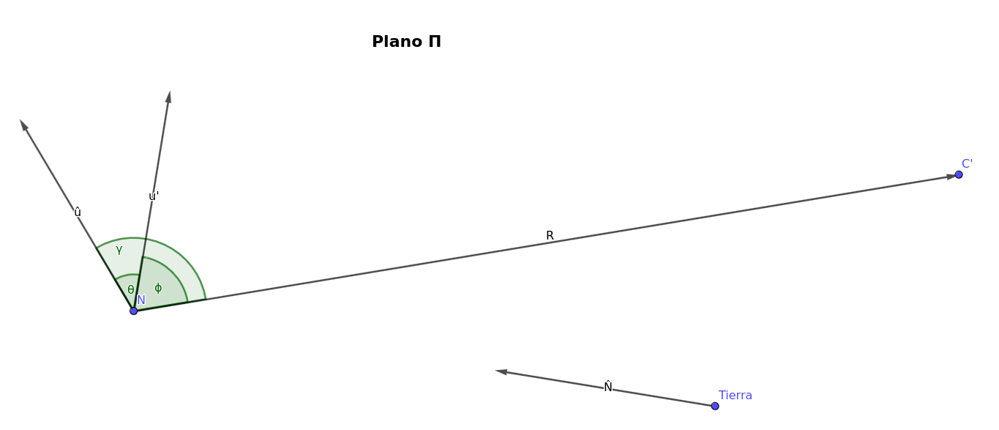

# Acotando Ese Ángulo

En este documento se describe el método usado para acotar la orientación de una nebulosa dada,
usando solamente los datos disponibles en el catálogo.

## Convenciones y Nomenclatura

Elejimos un sistema de coordenadas cartesianas con la tierra en el origen de coordenadas, con el eje
$x$ apuntando de la tierra al centro de la galaxia, y con el eje $z$ perpendicular al plano de la
galaxia.

Todos los vectores que se usen estarán descritos en este sistema de coordenadas.

Llamamos $\mathbf{C} = (8, 0, 0)\ kpc$ a la ubicación del centro de la galaxia.

Llamamos $\mathbf{N}$ a la ubicación de una nebulosa dada.

Llamamos $\hat{u}$ al vector unitario que apunta en la dirección (real, no proyectada) en la que está 
orientada la nebulosa. Existen dos elecciones posibles para $\hat{u}$ (opuestas entre sí); tomamos la
que está del lado del centro de la galaxia.

## Qué Queremos saber?

Queremos calcular el ángulo, en adelante $\alpha$, formado entre el eje de la nebulosa y la línea que une
la nebulosa con el centro de la galaxia.

Las observaciones no proveen información suficiente para calcular este ángulo como un valor puntual, pero
esperamos que un análisis suficientemente cuidadoso permita al menos establecer cotas superiores e
inferiores.

## Qué sabemos?

Para cada nebulosa, el catálogo contiene dos datos:
- La dirección desde la tierra hacia la nebulosa, en adelante representada por el vector unitario $\hat{N}$.
- La orientación de la nebulosa, como se ve proyectada sobre la esfera celeste; en adelante representada por el vector unitario $\hat{u}'$.

Estos dos datos permiten definir un plano, llamemoslo $\Pi$, que contiene a la tierra, a la nebulosa, y a $\hat{u}$.

Todo lo que sabemos de $\hat{u}$ es que está contenido en este plano. Parece razonable agregar la restricción
de que $\hat{u}$ no esté demasiado cerca de ser paralelo a $\hat{N}$, porque si lo fuera entonces $\hat{u}'$
no sería observable. Sería bueno que Juana et al. tuvieran a bien aclarar este punto y determinar algún ángulo
mínimo entre $\hat{u}$ y $\hat{N}$; provisoriamente el valor de 1º parece ser conservador.

## Qué No Sabemos?

El catálogo carece de dos datos con los cuales el problema quedaría totalmente resuelto:
- La distancia entre la tierra y la nebulosa, en adelante $|\mathbf{N}|$.
- El ángulo entre $\hat{u}$ y $\hat{u}'$, en adelante $\theta$.

$|\mathbf{N}|$ puede ser acotada, *grosso modo*, entre $1\ kpc$ y $3\ kcp$. Esto nos permite decir que
la ubicación de la nebulosa está sobre el segmento de recta descrito por $\mathbf{N} = |\mathbf{N}|\ \hat{N}$.

El hecho de que $\hat{u}'$ es perpendicular a $\hat{N}$, sumado a la observación de más arriba sobre el ángulo
entre $\hat{u}$ y $\hat{N}$, nos permite acotar $\theta$ al intervalo de $\pm 89º$, y descomponer a $\hat{u}$ en
$\cos \theta\ \hat{u}' + \sin \theta\ \hat{N}$.

## El Ángulo En Cuestión

Repetimos que nuestro objetivo es acotar el ángulo $\alpha$ formado entre $\hat{u}$ y la línea que une $\mathbf{N}$
y $\mathbf{C}$. Este ángulo está dado por:

$$ \cos \alpha = \hat{u} · \frac{\mathbf{C} - \mathbf{N}}{|\mathbf{C} - \mathbf{N}|} $$

$$ = \frac{1}{|\mathbf{C} - \mathbf{N}|}(\cos \theta\ \hat{u}' + \sin \theta\ \hat{N}) · (\mathbf{C} - |\mathbf{N}|\ \hat{N}) $$

$$ = \frac{1}{|\mathbf{C} - \mathbf{N}|}(\cos \theta\ \hat{u}'·\mathbf{C} - |\mathbf{N}|\ \cos \theta\ \hat{u}'·\hat{N} + \sin \theta\ \hat{N}·\mathbf{C} - |\mathbf{N}|\ \sin \theta\ \hat{N}^2) $$

$$ = \frac{1}{|\mathbf{C} - \mathbf{N}|}(\cos \theta\ \hat{u}'·\mathbf{C} + \sin \theta\ \hat{N}·\mathbf{C} - |\mathbf{N}|\ \sin \theta) $$

$$ = \frac{1}{|\mathbf{C} - \mathbf{N}|} \left(\cos \theta\ \hat{u}'·\mathbf{C} + \sin \theta\ (\hat{N}·\mathbf{C} - |\mathbf{N}|) \right)$$

En este punto es oportuno hacer algunas observaciones que permitirán simplificar esta última expresión:

- $\hat{u}'$ y $\hat{N}$ forman un conjunto ortonormal que sirve como sistema de coordenadas para el plano $\Pi$.
- Los coeficientes $\hat{u}'·\mathbf{C}$ y $\hat{N}·\mathbf{C}$ representan la proyección de $\mathbf{C}$ sobre $\Pi$.
  
  Esta proyección es importante y será llamada $\mathbf{C}'$.
  
- $\hat{u}'$ fue elegido de manera que la componente de $\mathbf{C}'$ en esta dirección es siempre positiva.
- Los coeficientes $\hat{u}'·\mathbf{C}$ y $\hat{N}·\mathbf{C} - |\mathbf{N}|$ representan al vector que va desde $\mathbf{N}$ hasta $\mathbf{C}'$.

  Resulta conveniente dar nombre al módulo de este vector y al ángulo que forma con $\hat{u}'$:

$$ A =: \hat{u}'·\mathbf{C} $$

$$ B =: \hat{N}·\mathbf{C} - |\mathbf{N}| $$

$$ R =: \sqrt{A^2 + B^2} $$

$$ \phi = \arcsin \frac{B}{R} $$

- Por último, toda la expresión que está entre paréntesis en la última ecuación es el producto escalar entre $\hat{u}$ y el vector que va desde $\mathbf{N}$ hasta $\mathbf{C}'$.

  Este producto escalar se puede reescribir como $R\ \cos \gamma$, donde $\gamma = \phi - \theta$ es el ángulo formado entre $\hat{u}$ y el vector que va desde $\mathbf{N}$ hasta $\mathbf{C}'$.

Reemplazando este último producto escalar en la ecuación de $\cos \alpha$ obtenemos la expresión simplificada:

$$ \cos \alpha = \frac{R}{|\mathbf{C} - \mathbf{N}|}\ \cos \gamma $$

Finalmente, al expandir todas aquellas definiciones que involucran datos no conocidos obtenemos:

$$
\cos \alpha = \sqrt{\frac{A^2 + (\hat{N}·\mathbf{C} - |\mathbf{N}|)^2}{(C_0 - |\mathbf{N}|\hat{N}_0)^2 + |\mathbf{N}|^2(\hat{N}^2_1 + \hat{N}^2_2)}}\ ·
\cos \left( \arcsin \left( \frac{\hat{N}·\mathbf{C} - |\mathbf{N}|}{\sqrt{A^2 + (\hat{N}·\mathbf{C} - |\mathbf{N}|)^2}} \right) - \theta \right)
$$

Donde los únicos datos no conocidos son $\theta$ y $|\mathbf{N}|$.

Y esta es la expresión a acotar.

## Acotando Cosas

Tenemos entonces una función escalar de dos variables $\theta$ y $|\mathbf{N}|$, y queremos encontrar el máximo y el mínimo
de esta función en el rectángulo definido por $\theta \in [-89º, 89º]$ y $|\mathbf{N}| \in [1 kpc, 3kpc]$.

La solución más correcta sería encontrar estos extremos analíticamente. Sin embargo, las derivadas parciales de $\cos \alpha$
son mucho más complejas de lo que uno quiciera calcular a mano, así que este camino no es viable. Esto nos deja con dos alternativas:

1. Usar las cotas de $\theta$ y $|\mathbf{N}|$ para acotar cada uno de los términos en la ecuación de $\cos \alpha$, y luego operar
   sobre las cotas de los distintos términos para contruir una cota de la expresión entera.

   Este método es subóptimo porque al acotar cada término se pierde información sobre cómo distintos términos se afectan entre sí,
   y no se obtiene la cota más acotada de todas las cotas.

2. Usar algún método numérico para para encontrar los extremos numéricamente.

   Los resultados así obtenidos son preferibles a los de la otra alternativa, pero el costo computacional puede ser elevado.

Ambas alternativas han de ser probadas, y sus resultados comparados.

