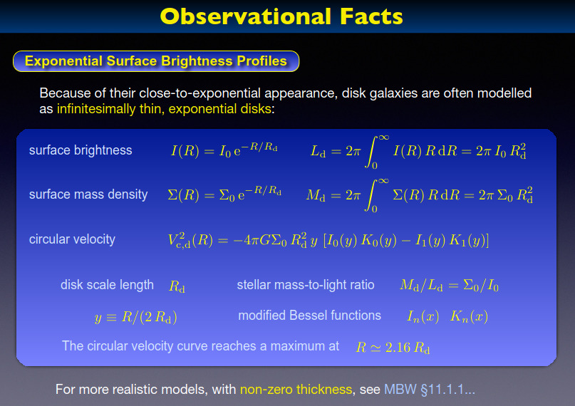

# Distribución Galáctica

El primer paso en el cálculo que queremos hacer es generar puntos aleatorios con una distribución que sea
consistente con la distribución de masa de la galaxia.

En este documento se describe el método usado por Peluca para generar esta distribución, y se lo compara
con el método usado en el póster. Comenzamos discutiendo solamente la distribución en el disco 2D, y más tarde
agregamos la distribución en el eje $z$.

## Marco Teórico

De acuerdo a una diapositiva proveída por Juana (fig. 1), la distribución de masa de la galaxia se modela como
un disco fino en el cual la densidad superficial es función solamente de la distancia al centro del disco y está
dada por

$$ \Sigma(R) = \frac{dM}{dA} = \Sigma_0 \ e^{-R/R_d} $$

Donde $M$ es la masa de la galaxia, $\Sigma_0$ es la densidadd superficial en el centro de la galaxia, $R$ es la
distancia al centro del disco, y $R_d$ es una longitud que determina la escala del disco.

Integrando esta expresión es fácil ver que la masa total de la galaxia es $M = 2\pi \Sigma_0 R_d^2$.

En este punto los lectores deverían notar que si bien esta es una distribución de densidad con decaimiento exponencial,
esta *no es*:

- Una distribución de probabilidad

  Porque la integral en todo su dominio es distinta de 1.
  
- Una distribución exponencial en [el sentido estadístico del término](https://es.wikipedia.org/wiki/Distribuci%C3%B3n_exponencial)

  Porque los coeficientes de adentro y afuera de la $e$ no son iguales, y porque describe una distribución en dos dimensiones y no en una.

*Figura 1: Una diapositiva proveída por Juana.*

## El método usado por Peluca

El método usado por Peluca es encontrar una distribución de probabilidad que sea proporcional a la distribución de masa.

La distribución de densidad de probabilidad (PDF) que necesitamos describe no la cantidad de masa que hay en un área dada del
disco, sino la *proporción* de la masa total que hay en un área dada del disco. Osea que la densidad de probabilidad se obtiene
dividiendo la densidad de masa por la masa total:

$$ PDF(R) = \frac{dM \over M}{dA} = \frac{\Sigma(R)}{M} = \frac{1}{2\pi R_D^2} \ e^{-R/R_d} $$

Y uno puede verificar que [la integral de la densidad de probabilidad en todo el disco](https://www.wolframalpha.com/input?i=integral+of+exp%28-R%2Fa%29*2pi*R%2F%282pi*a%5E2%29+dR+from+0+to+inf)
es igual a 1, es decir que esta es una distribución de probabilidad válida.

El siguiente paso es calcular la distribución de probabilidad acumulada (CDF). Esta es la proporción de puntos que están
a una distancia menor a $R$ del centro del disco y [se calcula](https://www.wolframalpha.com/input?i=integral+of+x*exp%28-x%2Fa%29%2Fa%5E2+from+0+to+R) fácilmente:

$$ CDF(R) = \int_{disco < R} PDF · dA = \int_0^R PDF(x) · 2\pi\ x \ dx =  $$

$$ CDF(R) = 1- e^{-R/R_d}\ (1 + R/R_d) $$

Y ahora que conocemos la CDF podemos usar el [método de la transformación inversa](https://es.wikipedia.org/wiki/M%C3%A9todo_de_la_transformada_inversa)
para generar valores de $R$ con la distribución correcta. Lamentablemente $CDF(R)$ no se puede invertir a mano, así
que hay que usar algún método numérico para esa parte del proceso.

Finalmente, uno genera un valor de $R$ mediante el método de la transformación inversa, genera un ángulo
$\theta$ con distribución unforme en $[0, 2\pi)$, y calcula las coordenadas:

$$ (x, y) = R · (\cos{\theta}, \sin{\theta}) $$

Por lo visto en el código usado para el póster, parece que se desea limitar los puntos generados a un rango $[R_{min}, R_{max}]$ de
distancias al centro del disco. Sería necesario aclarar por qué es necesario hacer ese recorte, y qué valores de $R_{min}$ y $R_{max}$
son deseables.

Pero procediendo bajo la hipótesis de que esa funcionalidad es necesaria, la única modificación que hay que hacer al método es
usar una distribución unforme en $[CDF(R_{min}),\ CDF(R_{max})]$ en vez $[0, 1]$ como variable para la transformación inversa.

En conclusión, para generar un punto aleatorio $P$ en el disco 2D con distribución de probabilidad consistente con la 
distribución de masa de la galaxia, el algoritmo usado por Peluca es:

1. Generar una variable aleatoria $U$ con distribución uniforme entre $CDF(R_{min})$ y $CDF(R_{max})$.
2. Calcular $R = CDF^{-1}(U)$.
3. Generar una variable aleatoria $\theta$ con distribución uniforme entre $0$ y $2\pi$.
4. Calcular $P = R · (\cos{\theta}, \sin{\theta})$.

## El método usado en el poster

El estilo de programación (o más bien la falta de uno) en el código usado para el poster hace que sea bastante
difícil inferir las intenciones de los autores. Lo que sigue es una descripción de la interpretación que Peluca
pudo hacer de este código, y de algunas razones por las que la distribución generada podría no ser correcta.

El algoritmo usado en el poster parece ser:

1. Generar una variable aleatoria $\epsilon$ con distribución uniforme en el intervalo $[\Sigma_{min},\ \Sigma_{max}] = [\Sigma(R_{max}),\ \Sigma(R_{min})]$.
2. Dividir $\epsilon$ por $\Sigma_0$. Esto parece ser una manera de adimensionalizar el intervalo.
3. Calcular $R$ usando $\epsilon/\Sigma_0$ como variable para la [transformación inversa de la distribución exponencial](https://es.wikipedia.org/wiki/Distribuci%C3%B3n_exponencial#M%C3%A9todos_computacionales).
4. Generar una variable aleatoria $\theta$ con distribución uniforme entre $0$ y $2\pi$.
5. Calcular $P = R · (\cos{\theta}, \sin{\theta})$.

Este algoritmo parece no ser correcto porque:

- Normaliza la distribución de masa de una manera que podría ser razonable para una distribución 1D pero no parece serlo para una distribución 2D.
- Usa el método de la transformación inversa con la CDF de *la* distribución exponencial. Como se mencionó anteriormente,
  esta distribución tiene deacimiento exponencial pero no es *la* distribución exponencial.
